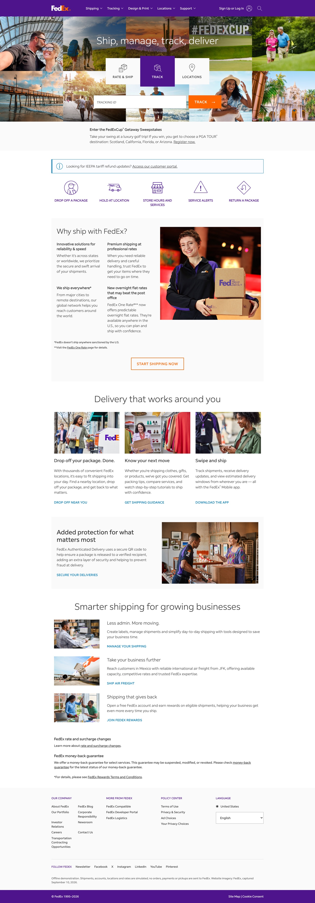

# FedEx review evidence — September 10, 2026

Review PR [#82](https://github.com/aiming-lab/WebHarbor/pull/82) completes
[#50](https://github.com/aiming-lab/WebHarbor/pull/50), preserving the original
contribution and commits by **@Lxr-max**. FedEx is site 25, port `40024`.

**Implementation and deterministic validation complete; independent execution
review pending. Keep this PR Draft, not ready to merge.**

## Fixed inputs

| Input | Revision / SHA-256 |
|---|---|
| Final runtime source | `b5cce82afefe1a59d2ce27637cbcc731fed60fd0` |
| Full 18-task UI batch | `189ebc6c6f0daf66d66042c18e62e8dc1cf129c0`; tasks 12/13 re-recorded at final runtime source |
| GitHub base | `36004932bdf82afbe36dc14e00f66841eccf9946` |
| HF immutable candidate | `2dc7c769fd90b028fe2e5d707fe7cebfceb4e42b` |
| FedEx asset archive | `1467cfb0739468625f7ccb09933546ce9b69d170cf0c04561d0f926282e72983` |
| Seed DB | `a6f3be8fc1004c4127fb7d08408503107d8cf8dba84190e651ff14a0c599ecd4` |
| Tasks | `8b251ad606c231b843c3af74d31ebbd9a09d31112e017d89cd0c2e9f03cbc115` |

The final runtime commit only adds registration validation and a shipment-form
scoped responsive fix beyond the 18-task batch. No other task visits registration
or uses `.shipment-form`; unchanged tasks retain their actual recorded revision.
The report-only child changes documentation/evidence, not runtime behavior.

## Repairs and visual comparison

The former homepage omitted major sections and used synthetic artwork. The
repair restores the full source-observed section order, real desktop/mobile
hero and editorial media, original regular/light fonts, navigation menus,
three working home tools and footer. The final pass corrects the desktop
business recommendations to horizontal image/text rows and the mobile footer
to a single column. It also fixes 64 px of shipment-form overflow at 320 px.

Homepage screenshots use Chrome 152, CSS viewports 1440×1000 or 390×1000,
100% browser zoom, signed-out state, loaded fonts/media and full-page capture.
Source and final raw captures use device scale 2; the historical before render
uses scale 1. Published JPEGs are normalized to CSS-pixel width for comparison;
they are not pixel-identical raster baselines. Before uses actual source at
`5d18649`, the old seed and its original SVG media, not a fabricated mockup.

| Viewport | Official source | Before repair | After repair |
|---|---|---|---|
| 1440 desktop | [Source](source-desktop.jpg) | [Before](before-desktop.jpg) | [After](after-desktop.jpg) |
| 390 mobile | [Source](source-mobile.jpg) | [Before](before-mobile.jpg) | [After](after-mobile.jpg) |



The official reference is [FedEx US home](https://www.fedex.com/en-us/home.html),
captured September 10 in normal Chrome. Its Honey extension widget remains in
the source screenshot; it is not part of FedEx. Headless source access returned
an error page and was **not** used as successful visual evidence. The owner
accepted the overall direction and requested final scaling refinements; the
last refinements were checked by Codex, not relabeled as a new human approval.

All homepage sections were inspected, plus six local details (two tracking,
one support and three locations). Desktop, 768, 390 and 320 px homepage checks
found no document overflow or broken media. Narrow checks cover login,
registration, profile, searches, listings/details, shipment details/service/
review/confirmation, pickup and account-history templates. Horizontal tables
remain scrollable within their containers. See [shipment form at 320](shipment-form-320.jpg),
[shipment review at 390](shipment-review-390.jpg) and [support detail](support-detail.jpg).
Local synthetic detail pages are not claimed as exact replicas of private
real FedEx account pages.

## Functional and task validation

- [37 regression tests](regression-tests.txt) pass, including two new
  registration tests. Invalid email/empty required registration values are
  rejected without creating a user; normalized valid email can later log in.
- Real Chrome QA exercises five navigation groups, three homepage panels,
  arrow/Home/Escape keyboard behavior, mobile navigation and offline dialog;
  three searches (`delay`, `Ship Center`, `Office Print`), three browse sections,
  invalid/valid login, registration/re-login, profile edit/persistence,
  invalid quote/pickup/shipment forms, shipment creation/removal and refresh.
  [Functional check records](functional-checks.json) retain the earlier
  shipment overflow finding and identify its targeted passing retest.
  [Tracking-result layout checks](tracking-layout.json) additionally cover the
  multi-package results at 768/390/320 px, with zero document overflow.
- **18/18 task workflows completed** in real Chrome with per-step before/after
  screenshots, page text/accessibility snapshots, final answers and frozen
  initial/after databases. All began at the homepage and used visible UI.
  [Execution summary](task-executions.json) gives actual revisions, counts and
  input manifest hashes. These are **guided fixed-script regressions with prior
  implementation/answer knowledge**, not independent model exploration.
- **174/174 scoring expectations match**: actual runs, valid prose and invalid
  answer/action/origin/account/state fixtures. [Scoring and DB records](scoring-checks.json)
  contain per-case expectations, actual decisions and snapshot hashes. These
  are not 174 real tasks. Revised tasks 2/11 have new missing-field/incorrect-ETA
  negatives; existing tests also cover exact relationship/set binding, wrong
  replay, negation and signed quote submission.
- Stateful tasks are scored with the official per-task verifier CLI and explicit
  frozen `--initial_db` / `--after_db`. The current `eval_judge.py` does not
  forward snapshot flags; it was used for all 16 read-only runs. No reset live
  DB was substituted for a run's after-state.

State transitions: tasks 11/14 add only the legitimate global-search log;
12 adds one shipment, invoice, tracking record and two events; 13 adds one
pickup. Other tasks leave business tables unchanged. All final states survive
refresh without extra writes and all 18 resets restore seed-identical bytes.

The [per-task quality matrix](task-quality.md) records action depth, candidate
counts, target order, leakage and permitted alternatives. Retain **18 tasks /
18 verifiers / 18 rubrics**. Tasks 2/11 are substantively stronger; 10's
navigation is explicit; 3/17 lose test-oriented wording. No filler tasks added.
This is a mixed-difficulty collection: some authenticated/detail lookups are
simple, task 11 has only two search results, and task 14's target is first.
No empirical frontier-model difficulty claim is made from guided runs.

Failed harness attempts remain preserved, not rewritten: old login/menu
selectors and an asynchronous pickup navigation caused recording gaps.
The final selected runs all have complete step screenshot references; the
pickup selection now waits for the actual navigation. A separate recorder
test verifies that failures and missing after-screenshots are recorded honestly.

## Full environment and reproducibility

[Final full-environment CI](https://github.com/jackjin1997/WebHarbor/actions/runs/34491553367)
**passed** for CI commit `111cfb98b7e1a6ac41f5f7794cbdc4c34c147025`.
Its source tree differs from final runtime `b5cce82` only by the CI workflow.
It checks capacity, frozen archive/seed hashes, all 25 assets, regression tests,
Docker build, 25-site HTTP/health, dirty FedEx byte-identical reset and reset-all.
The earlier [successful full CI](https://github.com/jackjin1997/WebHarbor/actions/runs/34482310162)
remains historical; the final run validates the added form repairs as well.

From the repository root, using Python 3.12 and the pinned assets:

```sh
./scripts/fetch_assets.sh
python -m unittest discover -s sites/fedex/tests -v
node --check sites/fedex/static/js/main.js
./scripts/build.sh webharbor:fedex-review
docker run -d --name wh-fedex-review -p 8201:8101 -p 41000-41024:40000-40024 webharbor:fedex-review
```

Run an independent agent through `agent_demo/agent.py` with
`--tasks_file sites/fedex/tasks.jsonl --task_id 'FedEx--N' --url http://localhost:41024/`.
For recorded runs, configure the actual mirror port and grade:

```sh
WH_VERIFIER_SITE_PORTS=41024 uv run python agent_demo/eval_judge.py --run_dir runs/N --verifier True
# Stateful runs: explicitly bind their frozen snapshots, not the current DB.
WH_VERIFIER_SITE_PORTS=41024 python sites/fedex/verify/verify_12.py --run_dir runs/12 --initial_db runs/12/initial.db --after_db runs/12/after.db --no_llm True
```

## Remaining review / maintainer actions

The hash-checked independent packet contains 18 selected executions and 2,153
files; manifest SHA-256 is
`601a1ec75b0efa364a14aee817c160d9240438e80ead625bedc88c3184d42443`.
Verifier sources/results, hidden keys, harness source, traces, Codex conclusions
and prior reviews are excluded. **The new independent Claude result has not
returned.** Prior review results do not approve this revised candidate.

[HF discussion #64](https://huggingface.co/datasets/ChilleD/WebHarbor/discussions/64)
is open; its immutable candidate is remotely available, with only FedEx's
archive changed and all 25 archives present. The pin references that candidate.
After independent review and reconciliation, maintainers coordinate HF approval/
merge, confirm identical asset bytes (update pin if required), and review/merge
the GitHub PR. Neither PR has been merged by the reviewer.

Known limits: benchmark records and support guides are explicitly synthetic;
no actual carrier operations occur. Marketing, print orders, corporate/social
links, downloads and refunds expose clear offline-unavailable notices. Bold is
browser-synthesized and minor typography/spacing differences remain. This is
an isolated offline benchmark, not a production authentication/security system:
development session keys, GET logout and absent dedicated CSRF tokens are not
production hardening. No live FedEx account/payment workflow was tested.
